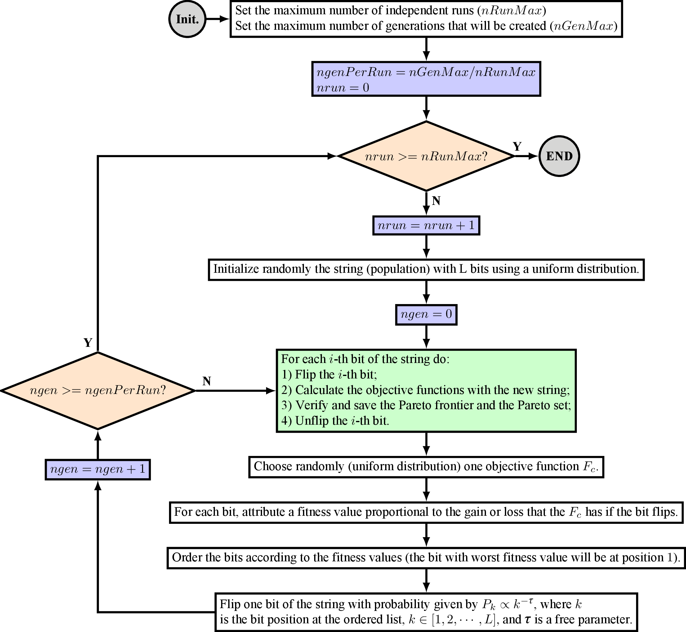

MGEOjulia - A Julia Library for MGEO
====================================

**MGEOjulia** is a Julia library that implements the Multiobjective Generalized
Extremal Optimization algorithm. It was coded by [Ronan Arraes Jardim
Chagas](http://www.inpe.br/ete/dse/ronan) at [INPE](http://www.inpe.br)
(National Institute for Space Research, *in portuguese*).

The code was based on [**MGEOCpp**](https://github.com/ronisbr/mgeocpp)

MGEO
----

GEO is an evolutionary algorithm developed at [INPE](http://www.inpe.br) [1]
that, along with its multiobjective version (M-GEO), has already been
successfully applied to a myriad of optimization engineering problems:

* Thermal design [2];
* Structural optimization [3];
* Satellite layout design [4];
* Spacecraft attitude controller for a rigid-flexible satellite [5];
* Design satellite constellations that minimize the average and the maximum
  revisit time over a region of interest [6];
* Given an analysis interval and a region of interest, design satellite
  constellations that minimize the number of spacecraft, the mean orbital
  altitude, and the area not accessible [7].

The flowchart of MGEO is [7]:



The library **MGEOjulia** codes in Julia the algorithm presented in the MGEO
flowchart.

Usage
-----

The minimal working code for **MGEOjulia** is:

```
using MGEOjulia

designVars = confDesignVars(N, {listOfBits}, {listOfMinimumValues}, {listOfMaximumValues}, {listOfNames})
mgeoData = MGEOStructure(nf, tau, ngenMax, runMax, designVars)
paretoFrontier = MGEOrun(mgeoData, f_obj)
savePFtoCSV("output.csv", designVars, paretoFrontier)
```
where

| Parameter                              | Description                                               | Type                                   | Example                                 |
| -------------------------------------- | --------------------------------------------------------- |:--------------------------------------:|:---------------------------------------:|
| N                                      | Number of design variables.                               | Int64                                  | 2                                       |
| nf                                     | Number of objective functions.                            | Int64                                  | 2                                       |
| tau                                    | Parameter to set the determinism of the search.           | Float64                                | 3.0                                     |
| ngenMax                                | Maximum number of generations that will be created.       | Int64                                  | 30000                                   |
| runMax                                 | Maximum number of independent runs.                       | Int64                                  | 50                                      |
| listOfBits                             | Number of bits for each design variable.                  | Array{Int64,1}                         | [8, 8]                                  |
| listOfMinimumValues                    | Minimum values for each design variable.                  | Array{Float64,1}                       | [-10.0, -5.0]                           |
| listOfMaximumValues                    | Maximum values for each design variable.                  | Array{Float64,1}                       | [5.0, 2.0]                              |
| listOfNames                            | List with the design variable names (OPTIONAL).           | Array{Strings,1}                       | ["Variable 1", "Variable 2"]            |

and **f_obj** must be a user-defined function that receives the design variables
and computes the objective functions. It must be defined as follows:

```
function f_obj(vars::Array{Float64,1})

    1) Read the design variables vars[1], vars[2], vars[3], ..., vars[N]
    2) Compute the objective functions f[1], f[2], f[3], ..., f[nf]
    3) Return (valid, f), where variable valid is false if the objective
       function evaluation was not performed correctly or true otherwise.

end
```

For more information, see the example file
[mgeojulia_testcases.cpp](./test/mgeojulia_testcases.jl).

Julia version
-------------

Only julia v0.3 is officially supported.

License
-------

This project is released under the **BSD 3-Clause License** (see
[LICENSE.md](./LICENSE.md) file).

Authors
-------

[Ronan Arraes Jardim Chagas](http://www.inpe.br/ete/dse/ronan) created MGEOjulia.

References
----------

[1] F. L. de Sousa, F. M. Ramos, P. Paglione, and R. M. Girardi, "**New
stochastic algorithm for design optimization**," *AIAA Journal*, vol. 41, no. 9,
pp. 1808-1818, 2003.

[2] A. P. C. Cuco, F. L. de Sousa, V. V. Vlassov, and A. J. da Silva Neto,
"**Multi-objective design optimization of a new space radiator**," *Optimization
and Engineering*, vol. 12, no. 3, pp. 393-406, 2011.

[3] F. L. de Sousa and W. K. Takahashi, **Generalized extremal optimization
applied to three-dimensional truss design**," in *18th Internation Congress of
Mechanical Enginering*. Ouro Preto, MG, Brazil: Associação Brasileira de
Engenharia e Ciências Mecânicas, 2005.

[4] A. P. C. Cuco, F. L. de Sousa, and A. J. S. Neto, "**A multi-objective
methodology for spacecraft equipment layouts**," *Optimization and Engineering
(Online)*, 2014.

[5] I. Mainenti-Lopes, L. C. G. Souza, and F. L. de Sousa, "**Design of a
nonlinear controller for a rigid-flexible satellite using multi-objective
generalized extremal optimization with real codification**," *Shock and
Vibration*, vol. 19, pp. 947-956, 2012.

[6] R. L. Galski, F. L. de Sousa, and F. M. Ramos, "**Application of a new
multiobjective evolutionary algorithm to the optimum design of a remote sensing
satellite constellation**," in *5th International Conference of Inverse Problems
in Engineering: Theory and Practice*, Cambridge, UK, 2005.

[7] R. A. J. Chagas, R. L. Galski, F. L. de Sousa, "**OrbGEO - An Orbit
Selection Tool for Satellite Constellations Using the Multiobjective Generalized
Extremal Optimization (MGEO) Algorithm**", in *6th International Conference on
Systems & Concurrent Engineering for Space Applications*, Stuttgart, Germany,
2014 (*in press*).